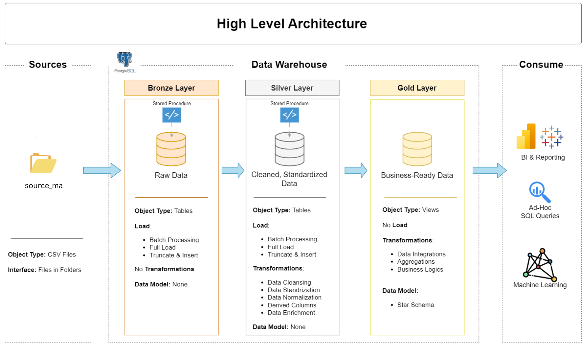

# Spotify Music Analytics Data Warehouse project
This project implements a modern Spotify Music Analytics Data Warehouse.
It ingests, cleans, transforms, and models Spotify track metadata spanning 2009–2023 and 2025, enabling analytics on artist popularity, track trends, genres, albums, and more.

---
## 🏗️ Data Architecture
The data architecture for this project follows Medallion Architecture **Bronze**, **Silver**, and **Gold** layers:

## Project Status
1. Bronze Layer(Done)
2. Silver Layer(X)
3. Gold Layer(X)

## Reference:
Data With Bara: https://www.youtube.com/@DataWithBaraa
